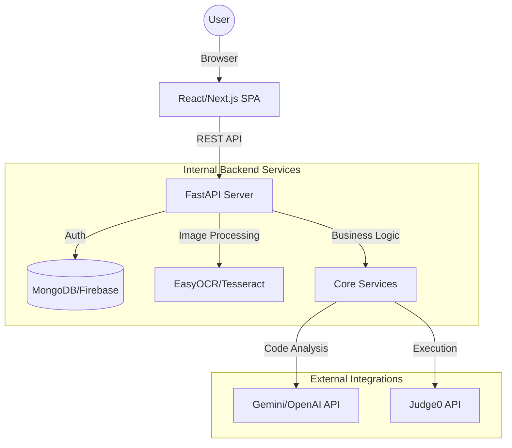

# Architecture Document - CodeDoctor AI

## 1. High-Level Architecture
CodeDoctor AI follows a modern **Client-Server** architecture with specialized micro-services for AI and Code Execution.



## 2. Technology Stack
### 2.1 Frontend
- **Framework:** Next.js (App Router) for SEO and performance.
- **Styling:** Tailwind CSS + Framer Motion (Animations).
- **Editor:** Monaco Editor (The core of VS Code) for professional code editing.
- **State Management:** React Context API or Zustand.
- **API Client:** Axios with Interceptors for Auth.

### 2.2 Backend
- **Language:** Python 3.10+.
- **Framework:** FastAPI (Asynchronous, High Performance).
- **Authentication:** JWT (JSON Web Tokens) with OAuth2.
- **OCR Engine:** EasyOCR (Modern and supports multiple languages).
- **Validation:** Pydantic for request/response schemas.

### 2.3 Database & Storage
- **Primary Database:** MongoDB (Flexible schema for storing various code snippets/reports).
- **Caching:** Redis (Optional, for caching Judge0 results).
- **File Storage:** AWS S3 or Cloudinary (For uploaded screenshots).

### 2.4 External APIs
- **LLM:** Google Gemini 1.5 Pro/Flash for deep code reasoning.
- **Runtime:** Judge0 CE (Compute Engine) for running code in 50+ languages.

## 3. Folder Structure
```bash
CodeDoctorAI/
├── frontend/             # Next.js Application
│   ├── src/
│   │   ├── components/   # UI Components (Editor, Results, Navbar)
│   │   ├── pages/        # Route Handlers
│   │   ├── services/     # API Service Layer
│   │   ├── hooks/        # Custom React Hooks
│   │   └── store/        # State Management
├── backend/              # FastAPI Application
│   ├── app/
│   │   ├── api/          # Route Controllers
│   │   ├── core/         # Config, Security, Constants
│   │   ├── models/       # DB Schemas (Pydantic/Beanie)
│   │   ├── services/     # AI, OCR, Judge0 wrappers
│   │   └── utils/        # Helper functions
│   ├── requirements.txt
│   └── main.py
└── docs/                 # Documentation (PRD, Architecture, etc.)
```

## 4. Communication Protocols
- **HTTP/S:** Standard RESTful communication.
- **WebSockets:** (Optional) For real-time updates during long-running code execution.

## 5. Deployment Strategy
- **Frontend:** Vercel (Automatic CI/CD from GitHub).
- **Backend:** Render or Railway (Dockerized FastAPI app).
- **Database:** MongoDB Atlas (Managed Cloud DB).
