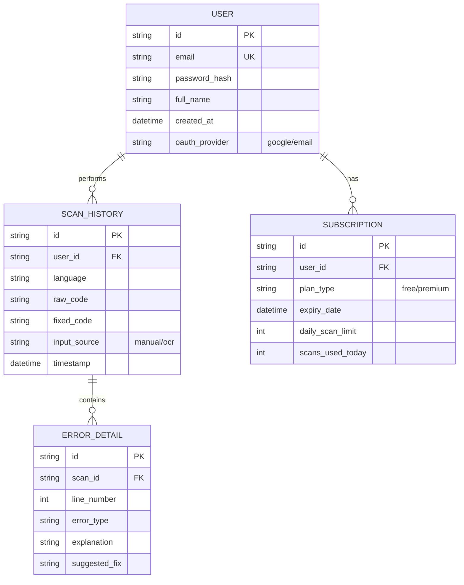

# CodeDoctor AI - Database Schema (ER Diagram)

This document describes the data structure and relationships between entities in the system.

## Entity Relationship Diagram

## Data Definitions

### Users
Stores account information and authentication metadata.

### Scan History
Records every interaction where a user submitted code for analysis. This allows for the "History" feature in the dashboard.

### Error Details
A granular breakdown of the issues found in a specific scan. This allows the UI to highlight multiple errors if they exist.

### Subscriptions
Manages the monetization aspect, tracking usage limits and plan status.
