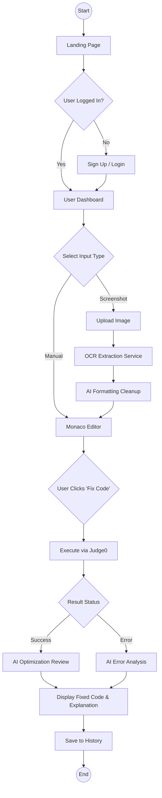
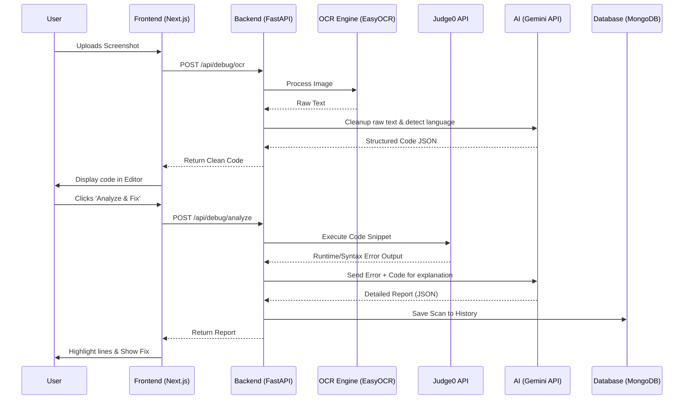
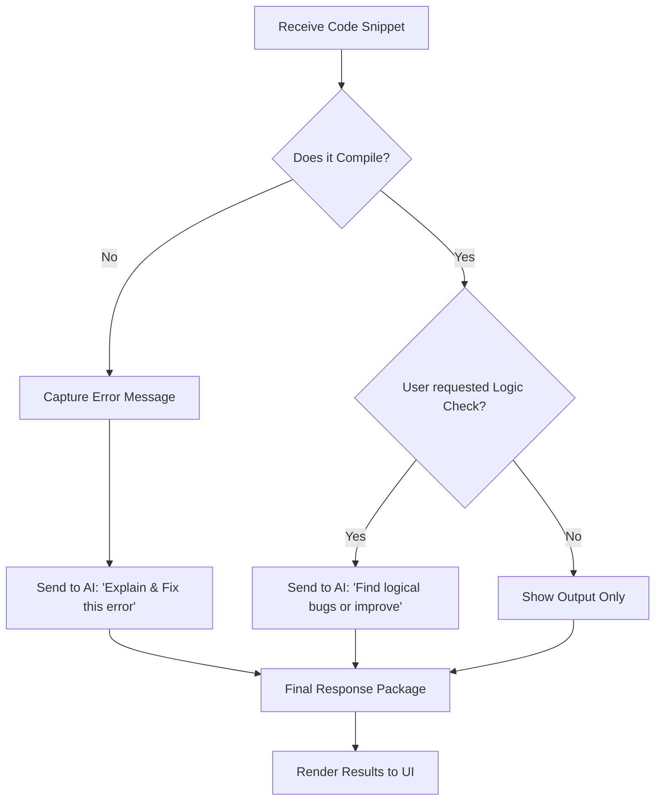

# CodeDoctor AI - Project Flowchart

This document visualizes the user journey and data processing flow within the application.

## 1. High-Level User Journey

## 2. Detailed Technical Data Flow

## 3. Logic Decision Tree (The "Brain")

